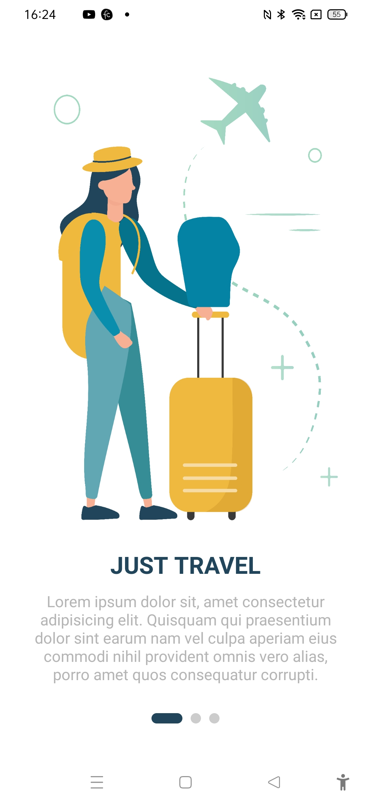
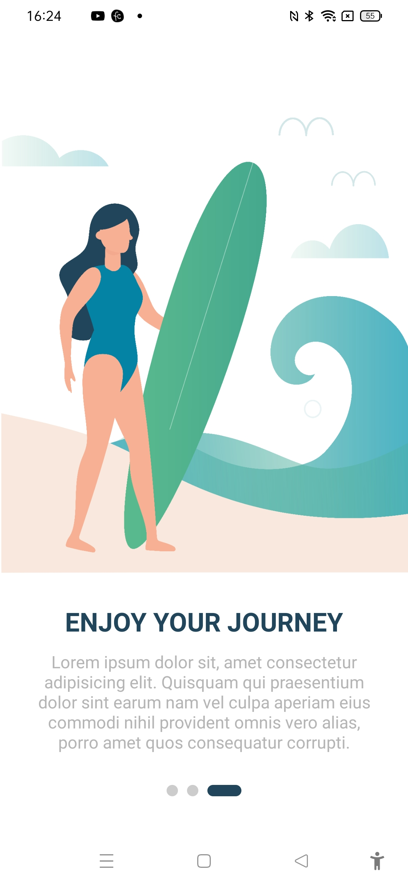
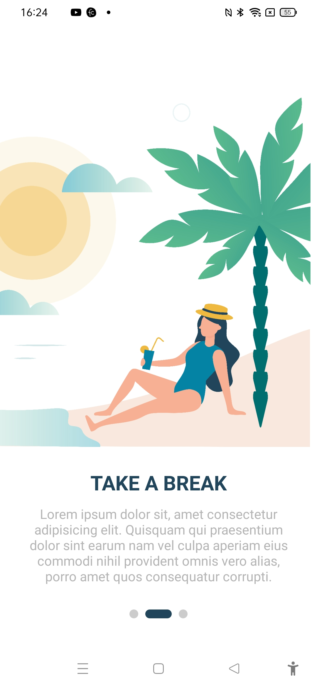

# App intro slider - Travel App UI







The project was created as part of learning React Native tutorial from the youtube channel 
DCode with Minte:

https://www.youtube.com/watch?v=mqNWTQ4CUoI&list=PL6sXCB6Pgqf9RbLaxmiSQQXp-a0_j56xe&index=14

## Learning

### App intro slider package installation

Goto

```url
[https://www.nativewind.dev/quick-starts/expo](https://www.npmjs.com/package/react-native-app-intro-slider)
```
Slider code

```js
export default function App() {
  const [showRealApp, setShowRealApp] = useState(false);

  return (
    <View style={styles.container}>
      <AppIntroSlider
      data={slides}
      renderItem={({ item,index }) => {
        return (
          <View >
            <Image
              source={item.image}
              style={{
                resizeMode: "cover",
                height: "73%",
                width: "100%",
              }}
            />
            <Text
              style={{
                paddingTop: 25,
                paddingBottom: 10,
                fontSize: 23,
                fontWeight: "bold",
                color: "#21465b",
                alignSelf: "center",
              }}
            >
              {item.title}
            </Text>
            <Text
              style={{
                textAlign: "center",
                color: "#b5b5b5",
                fontSize: 15,
                paddingHorizontal: 30,
              }}
            >
              {item.text}
            </Text>
          </View>
        );
      }}
      activeDotStyle={{backgroundColor:'#21465b',width:30}}
    />
    </View>    
  );
}

```
### Challenges faced

1. In between the updates in code, images were not loading.

### Learning further

1. Explore react native slider or create new slider
