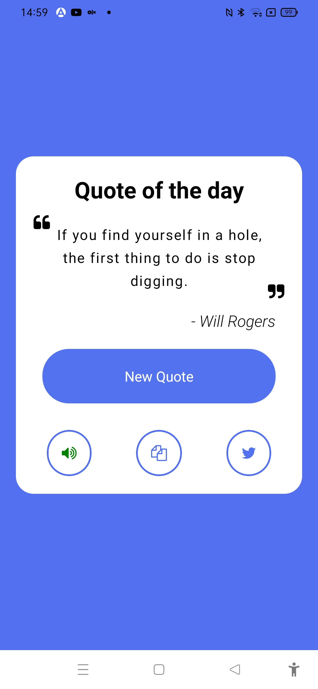

# Quote Generator App


The project was created as part of learning React Native tutorial from the youtube channel 
Pradip Debnath:

https://www.youtube.com/watch?v=OV0qnHInNw0

## Learning

### Adding icon using fontawesome
```js
import FontAwesome from "react-native-vector-icons/FontAwesome";

<FontAwesome name="quote-left" style={styles.quoteSymbolLeft} />

<FontAwesome name="volume-up" size={18} style={{color:isSpeaking?'red':'green'}} />
```

### Getting random quote:

```js
const getQuote=async()=>{
    try{
      setIsLoading(true)
      const result=await fetch('http://api.quotable.io/random');
      const jsonData=await result.json();
      setIsLoading(false);
      setQuote(jsonData.content);
      setAuthor(jsonData.author);
    }catch(e){
      console.log(e)
    }
  }
```

### Adding text to speech:

```js
import * as Speech from 'expo-speech';

const [isSpeaking,setIsSpeaking]=useState(false);

const speakUp=()=>{
    const thingToSay = quote;
    Speech.stop();
    Speech.isSpeakingAsync().then(()=>setIsSpeaking(true));
    Speech.speak(thingToSay+'     '+author,{onDone:()=>setIsSpeaking(false)});
  }
```
### Copy to clipboard

```js
import * as Clipboard from 'expo-clipboard';

const copyToClipboard = async () => {
    await Clipboard.setStringAsync(quote);
  };
```

### Posting in twitter

```js
import { StyleSheet, Text, View, TouchableOpacity, Linking } from "react-native";

const tweetNow=()=>{
    const url='https://twitter.com/intent/tweet?text='+quote;
    Linking.openURL(url);
  }
```

### Challenges faced

1. Struggled with text to speech library. Used expo specific library to solve
2. Struggled with clipboard library. Used expo specific library to solve.


### Learning further

1. Learning more ui design with React Native
