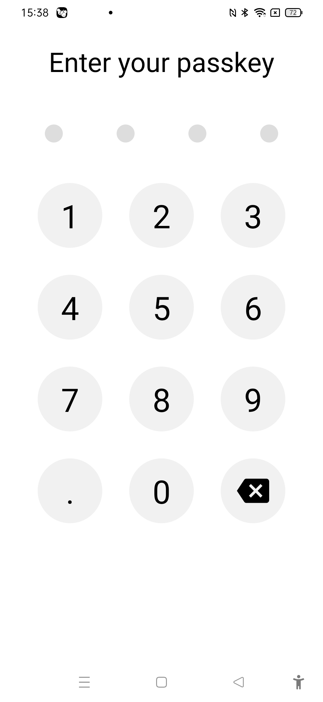

# Security Lock Screen App


The project was created as part of learning React Native tutorial in the youtube channel Flaira:

https://www.youtube.com/watch?v=PaRyx0CUTnI


## Learnings

### Adjusting space with respect to app dimension
```js
import {
  Dimensions,
} from "react-native";

const { width, height } = Dimensions.get("window");

const dialPadSize = width * 0.2;

<MaterialIcons name="backspace" size={dialPadSize/2} />

width: dialPadSize,
    height: dialPadSize,
    borderRadius: dialPadSize / 2,
```

### Adding material icon for backspace:

```js
{text === "del" ? (
    <MaterialIcons name="backspace" size={dialPadSize/2} />
)
```

### Creating array from a limit value:

```js
let keys = [...Array(numberLimit).keys()].map((i) => i + 1);
keys = [...keys, ".", 0, "del"];
```

### Implementing backspace functionality:

```js
const keyPressHandler = (text) => {
    if (text === "del") {
      setPinCode((prevPassText) =>
        prevPassText.slice(0, prevPassText.length - 1)
      );
    }else{
      setPinCode((prevPassText) => {
        if (prevPassText.length < lockLength) {
          return [...prevPassText, text];
        }
      });
    }
  };
```

### Creating circular display

```js
<View style={styles.lock}>
        {[...Array(lockLength).keys()].map((i) => {
          const isSelected = !!pinCode[i];
          return (
            <View
              key={i}
              style={[styles.lockContainer, { height: isSelected ? 20 : 2 }]}
            ></View>
          );
        })}
      </View>
```
