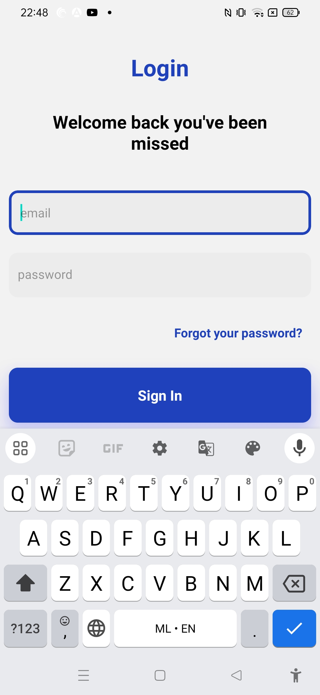

# Login Register UI





The project was created as part of learning React Native tutorial using the youtube tutorial:
Tugane Amiel

https://www.youtube.com/watch?v=mI5AC_oYucY

## Learning

### Constants creation and usage
create different constants in a folder called constants:
1. Colors:
  ```js
const white = "#fff";
const black = "#000";
const dark = "#626262";
const blue = "#1F41BB";
const gray = "#ECECEC";
const lightBlue = "#f1f4ff";

export default {
  darkText: dark,
  text: black,
  background: white,
  primary: blue,
  onPrimary: white,
  active: blue,
  borderWithOpacity: "#1f41bb",
  lightPrimary: lightBlue,
  gray: gray,
};
   ```  
2. FontSize:
  ```js
const small: number = 14;
const medium: number = 16;
const large: number = 20;
const xLarge: number = 30;
const xxLarge: number = 35;

export default {
  small,
  medium,
  large,
  xLarge,
  xxLarge,
};
``` 
3. Layout:
  ```js
import { Dimensions } from "react-native";

const width = Dimensions.get("window").width;
const height = Dimensions.get("window").height;

export default {
  width,
  height,
  isSmallDevice: width < 375,
};

```
Usage of constants:
```js
padding: Spacing * 1.5,
borderRadius: Spacing * 1.5,
```
### Adding shadows
```js
style={{
          margin: 10,
          padding: 20,
          borderRadius: 10,
          backgroundColor: Colors.active,
          shadowColor: "blue",
          shadowOpacity: 0.1,
          elevation: 20,
          shadowOffset: {
            height: 0,
            width: 1,
          },
          shadowRadius: 1,
        }}
```

### Text input component
focus is update on blur and focus events
```js
import { View, Text, TextInput, TouchableOpacity } from "react-native";
import Spacing from "../constants/Spacing";
import Colors from "../constants/Colors";
import { useState } from "react";

const TextInputComponent = ({ text }) => {
  const [focused, setFocused] = useState(false);
  return (
    <View
      style={[
        {
          backgroundColor: Colors.gray,
          height: Spacing * 5,
          margin: 10,
          borderRadius: 10,
          padding: 10,
        },
        focused && {
          borderWidth: 3,
          borderColor: Colors.primary,
          shadowColor: Colors.primary,
          shadowOffset: { width: 4, height: Spacing },
          shadowOpacity:0.3,
          shadowRadius:Spacing
        },
      ]}
    >
      <TextInput
        placeholder={text}
        onFocus={() => setFocused(true)}
        onBlur={() => setFocused(false)}
      />
    </View>
  );
};

export default TextInputComponent;

```
### Navigation
Install navigation packages from 
```cmd
npm install @react-navigation/native
npm install @react-navigation/native-stack
```
Setting up navigation
```js
import { NavigationContainer } from '@react-navigation/native';
import { createNativeStackNavigator } from '@react-navigation/native-stack';
import HomeScreen from './screens/homescreen';
import Registration from './screens/registration';
import Login from './screens/login';

export default function App() {
  const Stack=createNativeStackNavigator();

  return (
    <NavigationContainer>
      <Stack.Navigator screenOptions={{headerShown:false}}>
        <Stack.Screen name='homescreen' component={HomeScreen}/>
        <Stack.Screen name='login' component={Login}/>
        <Stack.Screen name='registration' component={Registration}/>
      </Stack.Navigator>
    </NavigationContainer>
  );
}

```
Navigating to different pages on clicking link:
```js
const HomeScreen = ({ navigation }) => {
...
....
onPress={()=>navigation.navigate('login')}
```

### Challenges faced
1. Adding navigation
   
### Learning further
1. Need to practice more ui design with React Native
