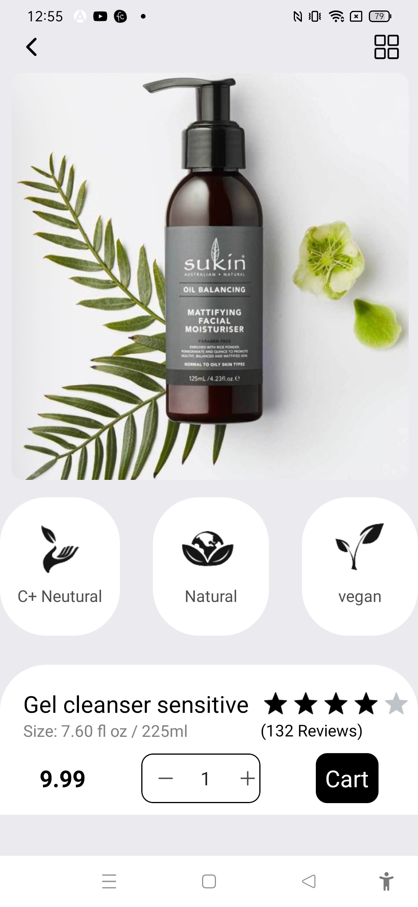

# Timed Interval Component


The project was created as part of learning React Native tutorial using the following link

https://codesandbox.io/p/sandbox/progress-bar-using-setinterval-and-react-hooks-8iyq7?file=%2Fsrc%2FApp.js

## Learning

### Timed interval component
```js
useEffect(() => {
    let timer;
    isActive
      ? (timer = setInterval(() => {
          console.log("hello world");
          setProgress((progress) => progress + 0.1);
        }, 1000))
      : clearInterval(timer);
    return () => clearInterval(timer);
  }, [isActive]);

  useEffect(() => {
    if (progress >= 1) {
      setIsActive(false);
    }
  }, [progress]);

<View style={styles.container}>
      {progress>=1?<Text>This text is displayed only after 10 seconds</Text>:null}
      <StatusBar style="auto" />
    </View>
```

### Challenges faced

1. Adjusting time interval using setInterval method. Initially tried with setTimeout method

### Learning further

1. Need to practice with timed component more
