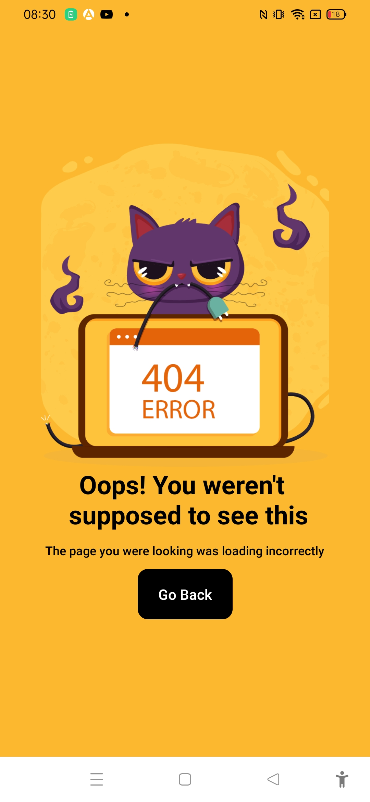

# Error screen ui


The project was created as part of learning React Native tutorial using the youtube tutorial:
Code Spring

https://www.youtube.com/watch?v=rOy8neGw6XQ

## Learning

### Installing reanimated package
```cmd
npm i react-native-reanimated
```
using animated
```js
import Animated,{useSharedValue,FadeInUp,FadeOutUp} from "react-native-reanimated";

<Animated.View 
    entering={FadeInUp}
    exiting={FadeOutUp}
    style={{
      top:70,
      backgroundColor:'#20639B',
      width:'90%',
      borderRadius:5,
      padding:20,
      flexDirection:'row',
      justifyContent:'flex-start',
      alignItems:'center',
      shadowColor:'#003049',
      shadowOpacity:0.4,
      shadowRadius:2,
      shadowOffset:{width:0,height:1},
      elevation:2
    }}>
      <MaterialIcons name="info" size={30} color={'#F6F4F4'}/>
      <View>
        <Text style={{
          fontSize:18,
          color:'#F6F4F4',
          fontWeight:'bold',
          marginLeft:10,
        }}>Info</Text>
        <Text
        style={{
          fontSize:14,
          color:'#F6F4F4',
          marginLeft:10,
        }}
        >This is an animated toast messag</Text>
      </View>
    </Animated.View>
```
### Challenges faced

1. Installing reanimated package

### Learning further

1. Need to practice more about animation with reanimated
