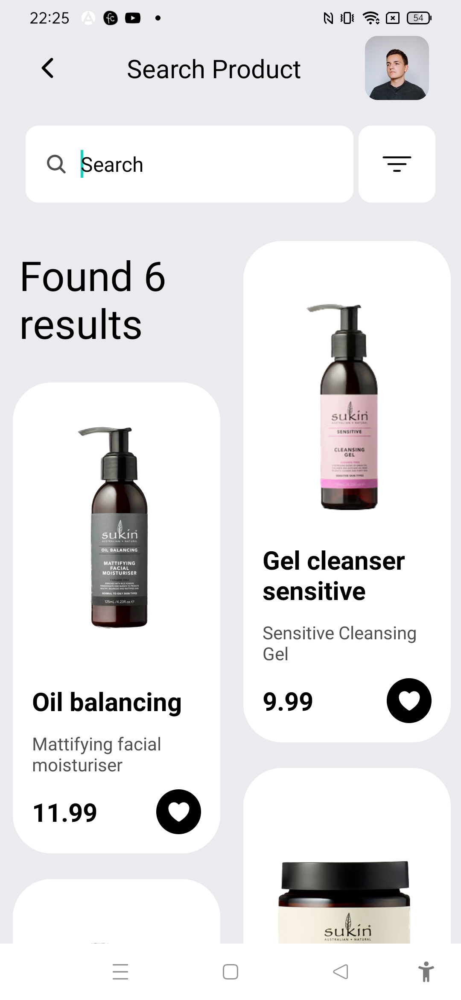
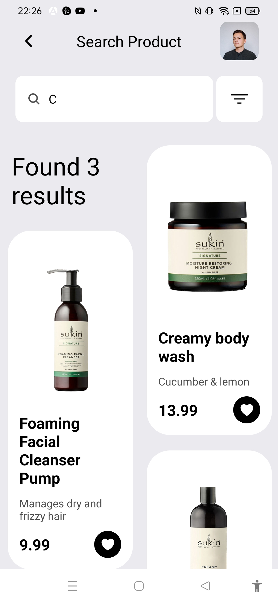

# Skin care App UI-screen 1 





The project was created as part of learning React Native tutorial from the youtube channel 
Tugane Amiel:

https://www.youtube.com/watch?v=_fxpc_xyV4A

## Learning

### Saving user and product data

```js
export const user = {
  name: "tugane",
  profile: require("../assets/images/avatar.jpeg"),
};


const ingredients= [
  {
    name: "C+ Neutural",
    id: 1,
    image: require("../assets/images/ingredients/CNeutural.png"),
  },
  {
    name: "Natural",
    id: 2,
    image: require("../assets/images/ingredients/Natural.png"),
  },
  {
    name: "vegan",
    id: 3,
    image: require("../assets/images/ingredients/Vegan.png"),
  },
];

export const Products= [
  {
    id: 1,
    image: require("../assets/images/products/SensiviteCleansingGel.png"),
    cover: require("../assets/images/products/SukinCleansingGelCover.jpg"),
    subTitle: "Sensitive Cleansing Gel",
    title: "Gel cleanser sensitive",
    price: 9.99,
    ingredients,
    size: "7.60 fl oz / 225ml",
    rating: 4,
    reviewsCount: 132,
  },
  {
    id: 3,
    image: require("../assets/images/products/Oilbalancing.png"),
    cover: require("../assets/images/products/Oilbalancingcover.png"),
    subTitle: "Mattifying facial moisturiser",
    title: "Oil balancing",
    price: 11.99,
    ingredients,
    size: "7.60 fl oz / 225ml",
    rating: 4,
    reviewsCount: 132,
  },
  {
    id: 7,
    image: require("../assets/images/products/Signature_Moisture_Restoring_Night.png"),
    cover: require("../assets/images/products/Signature_Moisture_Restoring_Night.jpg"),
    subTitle: "Cucumber & lemon",
    title: "Creamy body wash",
    price: 13.99,
    ingredients,
    size: "7.60 fl oz / 225ml",
    rating: 4,
    reviewsCount: 132,
  },

  {
    id: 5,
    image: require("../assets/images/products/SignatureFoamingFacialCleanser.png"),
    cover: require("../assets/images/products/SignatureFoamingFacialCleansercover.jpg"),
    subTitle: "Manages dry and frizzy hair",
    title: "Foaming Facial Cleanser Pump",
    price: 9.99,
    ingredients,
    size: "7.60 fl oz / 225ml",
    rating: 4,
    reviewsCount: 132,
  },
  {
    id: 6,
    image: require("../assets/images/products/CreamyBodyWash.png"),
    cover: require("../assets/images/products/CreamyBodyWashCOVER.jpg"),
    subTitle: "Cucumber & lemon",
    title: "Creamy body wash",
    price: 13.99,
    ingredients,
    size: "7.60 fl oz / 225ml",
    rating: 4,
    reviewsCount: 132,
  },
  {
    id: 4,
    image: require("../assets/images/products/Sensitive_Soap_Free_Body_Wash.png"),
    cover: require("../assets/images/products/Soap_Free_Body_Washcover.jpg"),
    subTitle: "Soap Free Sensitive Body Wash",
    title: "Soap Free Body Wash",
    price: 11.99,
    ingredients,
    size: "7.60 fl oz / 225ml",
    rating: 4,
    reviewsCount: 132,
  },
];
```
### Saving and using FontSize and Spacing parameters

#### Font Size
```js
const xs= 12;
const sm= 14;
const base= 16;
const lg= 20;
const xl= 30;
const xxl= 35;

export default {
  xs,
  sm,
  base,
  lg,
  xl,
  xxl,
};
```

#### Spacing
```js
const sm = 5;
const base = 10;
const lg = 20;
const xl = 30;
const xxl = 40;
export default {
  padding: {
    xs: 5,
    sm: 10,
    base: 15,
    lg: 30,
    xl: 50,
    xxl: 70,
  },
  margin: {
    sm,
    base,
    lg,
    xl,
    xxl,
  },
  borderRadius: { sm, base, lg, xl, xxl },
};
```

#### Using fontSize and spacing example
```css
padding:Spacing.padding.base,

fontSize: FontSize.base,
```

### Masonry List
Install Masonry list
```cmd
npm i @react-native-seoul/masonry-list
```
Usage
```js
import MasonryList from "@react-native-seoul/masonry-list";

<MasonryList
            data={[{id:0,name:`Found ${results.length} results`},...results]}
            keyExtractor={(item) => item.id}
            numColumns={2}
            showsVerticalScrollIndicator={false}
            renderItem={({ item,i }) => (<>
              {
                i==0?<Text style={{fontSize:32,padding:Spacing.padding.base}}>{item.name}</Text>:
              <TouchableOpacity
                style={{
                  padding:Spacing.padding.base,
                  backgroundColor: Colors.primary,
                  width: "90%",
                  margin: Spacing.margin.base,
                  borderRadius:Spacing.borderRadius.xl
                }}
              >
                <Image
                  source={item.image}
                  style={{ width: "100%", height: 220 }}
                />
                <Text style={{fontWeight:'bold',fontSize:FontSize.lg,color:Colors.text}}>{item.title}</Text>
                <Text style={{color:Colors.textGray,marginVertical:Spacing.margin.base}}>{item.subTitle}</Text>
                <View style={{
                  flexDirection:'row',
                  alignItems:'center', 
                  justifyContent:'space-between'
                }}>
                  <Text style={{fontSize:FontSize.lg, fontWeight:'bold'}}>{item.price}</Text>
                  <TouchableOpacity style={{
                    height:35,
                    width:35,
                    backgroundColor:Colors.accent,
                    justifyContent:'center',
                    alignItems:'center',
                    borderRadius:Spacing.borderRadius.xl
                  }}>
                    <Ionicons name="heart" size={20} color={Colors.onAccent}/>
                  </TouchableOpacity>
                </View>
              </TouchableOpacity>
              }
            </>
            )}
          />
```

### Searching

```js
const [search, setSearch] = useState("");
  const [results, setResults] = useState(Products);
  useEffect(()=>{
    setResults(Products.filter(product=>product.title.includes(search)))
  },[search])
```

### Challenges faced

1. Masonry list wasnot loading due to some typo

### Learning further

1. Analyse why MasonryList is required, why not Flatlist?
