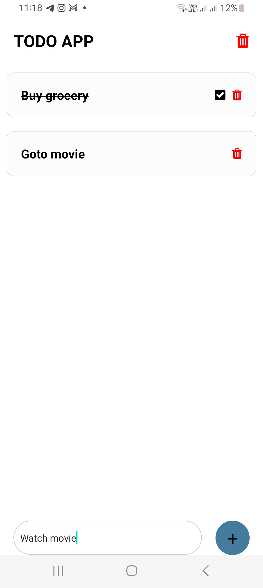

# Quote Generator App


The project was created as part of learning React Native tutorial from the youtube channel 
Kymz Tech:

https://www.youtube.com/watch?v=2MjAAcF0L5s

## Learning

### Styling list item
```js
const styles = StyleSheet.create({
  todoItem: {
    flexDirection: "row",
    justifyContent: "space-between",
    alignItems: "center",
    margin: 10,
    backgroundColor: "rgba(245,245,245,.3)",
    borderWidth: 0.5,
    borderColor: "#ccc",
    padding: 20,
    borderRadius: 10,
  },
  todoItemText: {
    fontSize: 18,
    fontWeight: "bold",
  },
  todoItemIconContainer: {
    flexDirection: "row",
    gap: 10,
    justifyContent: "center",
    alignItems: "center",
  },
});

```

### Marking task as completed with line-through
```js
const [completed, setCompleted] = useState(false);
  const completeHandler = () => {
    setCompleted(true);
  };

<TouchableOpacity onPress={() => completeHandler()}>
      <View style={styles.todoItem}>
        <Text
          style={[
            styles.todoItemText,
            { textDecorationLine: completed ? "line-through" : "none" },
          ]}
        >
          {item.todo}
        </Text>
        <View style={styles.todoItemIconContainer}>
          {completed && <FontAwesome name="check-square" size={18} />}
          <TouchableOpacity onPress={() => deleteIndividualHandler(item.id)}>
            <FontAwesome name="trash" size={18} color={"red"} />
          </TouchableOpacity>
        </View>
      </View>
    </TouchableOpacity>
```

### Defining and using global colors:

```js
const COLORS = { primary: "#457b9d", white: "#fff" };

backgroundColor: COLORS.primary,
```

### Adding text to speech:

```js
import * as Speech from 'expo-speech';

const [isSpeaking,setIsSpeaking]=useState(false);

const speakUp=()=>{
    const thingToSay = quote;
    Speech.stop();
    Speech.isSpeakingAsync().then(()=>setIsSpeaking(true));
    Speech.speak(thingToSay+'     '+author,{onDone:()=>setIsSpeaking(false)});
  }
```
### Copy to clipboard

```js
import * as Clipboard from 'expo-clipboard';

const copyToClipboard = async () => {
    await Clipboard.setStringAsync(quote);
  };
```

### Posting in twitter

```js
import { StyleSheet, Text, View, TouchableOpacity, Linking } from "react-native";

const tweetNow=()=>{
    const url='https://twitter.com/intent/tweet?text='+quote;
    Linking.openURL(url);
  }
```

### Challenges faced

1. Struggled with text to speech library. Used expo specific library to solve
2. Struggled with clipboard library. Used expo specific library to solve.


### Learning further

1. Learning more ui design with React Native
