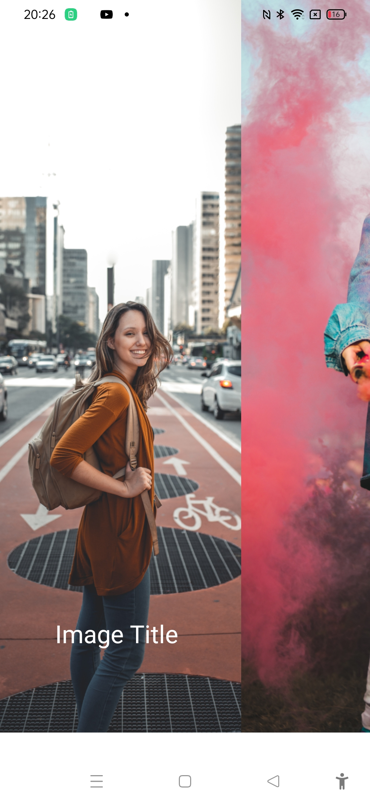
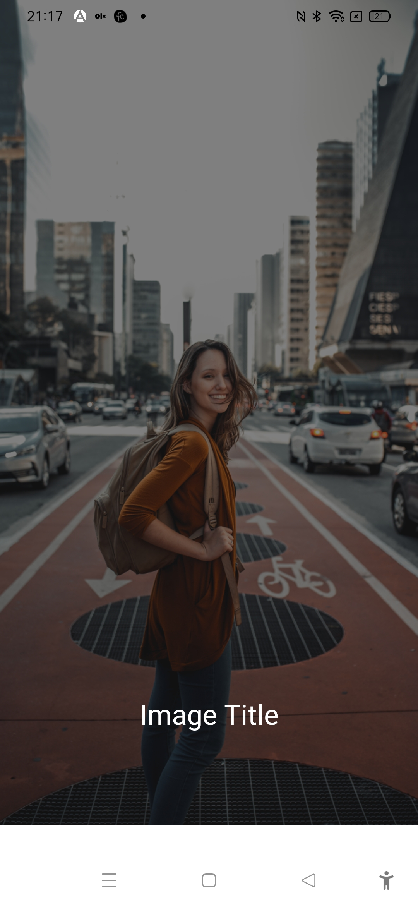

# Custom modal demo App



The project was created as part of learning React Native tutorial from the youtube channel 
Coding with Artem:

https://www.youtube.com/watch?v=osE2NKPsz-s

## Learning

### Creating modal and styling
```js
<Modal transparent visible={visible}>
            <View style={styles.modalBackground}>
                <Animated.View style={[styles.modalContainer,{transform:[{scale:fadeAnim}]}]}>
                    <View style={styles.header}>
                        <TouchableOpacity onPress={()=>updatetoggleModalHandler()}>
                        <Image
                        source={require('../assets/x.png')}
                        style={{height:30,width:30}}/>
                        </TouchableOpacity>
                    </View>
                    <Image
                    source={require('../assets/success.png')}
                    style={{height:150,width:150,marginVertical:10}}/>
                    <Text style={{textAlign:'center',marginVertical:30,fontSize:20}}>Congratulations registration was successfull</Text>
                </Animated.View>
            </View>
        </Modal>


const styles=StyleSheet.create({
    modalBackground:{
        flex:1,
        backgroundColor:'rgba(0,0,0,0.4)',
        justifyContent:'center',
        alignItems:'center'
    },
    modalContainer:{
        width:'80%',
        backgroundColor:'#fff',
        paddingHorizontal:20,
        paddingVertical:30,
        borderRadius:20,
        elevation:20,
        alignItems:'center'
    },
    header:{
        width:'100%',
        height:40,
        alignItems:'flex-end',
        justifyContent:'center'
    }
})
```

### Updating animation:

```js
 const fadeAnim = useRef(new Animated.Value(0)).current;
    // const [fadeAnim,setFadeAnim]=useState(new Animated.Value(0));

    useEffect(()=>{
        if(visible){
            console.log('visible');
            Animated.spring(fadeAnim, {
                toValue: 1,
                duration: 500,
                useNativeDriver: true,
              }).start();     
        }
      },[visible])

      function updatetoggleModalHandler(){
        if(visible){
            setTimeout(()=>toggleModalHandler(),500);
            Animated.timing(fadeAnim, {
                toValue: 0,
                duration: 500,
                useNativeDriver: true,
              }).start();
        }else{
            toggleModalHandler();
        }
      }
```
