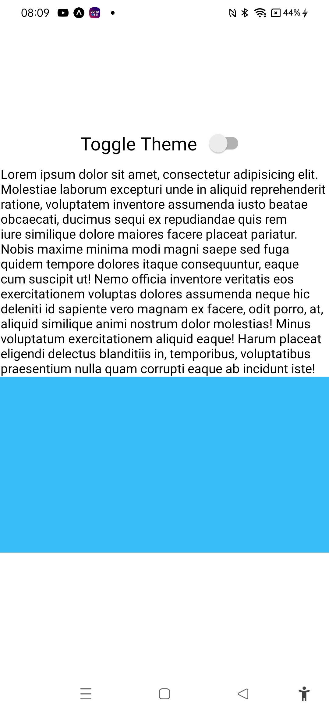

# Theme switcher app in tailwind




The project was created as part of learning React Native tutorial from the youtube channel 
Code With Nomi:

https://www.youtube.com/watch?v=2MHBfatlC5g

## Learning

### Tailwind installation

Goto

```url
https://www.nativewind.dev/quick-starts/expo
```
Install tailwind and nativewind
```cmd
npm install nativewind
npm install --save-dev tailwindcss@3.3.2
```
set up tailwind css
```cmd
// tailwind.config.js

module.exports = {
+ content: ["./App.{js,jsx,ts,tsx}", "./<custom directory>/**/*.{js,jsx,ts,tsx}"],
  theme: {
    extend: {},
  },
  plugins: [],
}
```cmd
Add Babel plugin
```cmd
// babel.config.js
module.exports = function (api) {
  api.cache(true);
  return {
    presets: ["babel-preset-expo"],
+   plugins: ["nativewind/babel"],
  };
};

```

### useColorScheme from nativewind
```js
import { useColorScheme } from 'nativewind';
```

```js
const {colorScheme,toggleColorScheme}=useColorScheme();
```

```js
<Switch value={colorScheme=='dark'} onChange={toggleColorScheme}/>
```

### Styling with tailwind
```html
<View className='flex-1 justify-center items-center dark:bg-neutral-900'>
      <View className='flex-row justify-center items-center space-x-2'>
      <Text className='text-xl dark:text-white'>Toggle Theme</Text>
      <Switch value={colorScheme=='dark'} onChange={toggleColorScheme}/>
      </View>
      <Text className='dark:text-white'>Lorem ipsum dolor sit amet, consectetur adipisicing elit. Molestiae laborum excepturi unde in aliquid reprehenderit ratione, voluptatem inventore assumenda iusto beatae obcaecati, ducimus sequi ex repudiandae quis rem iure similique dolore maiores facere placeat pariatur. Nobis maxime minima modi magni saepe sed fuga quidem tempore dolores itaque consequuntur, eaque cum suscipit ut! Nemo officia inventore veritatis eos exercitationem voluptas dolores assumenda neque hic deleniti id sapiente vero magnam ex facere, odit porro, at, aliquid similique animi nostrum dolor molestias! Minus voluptatum exercitationem aliquid eaque! Harum placeat eligendi delectus blanditiis in, temporibus, voluptatibus praesentium nulla quam corrupti eaque ab incidunt iste!</Text>
      <StatusBar style='auto'/>
      <View className='h-48 w-full bg-sky-400 dark:bg-emerald-400'></View>
    </View>
```

### Challenges faced

1. Nil

### Learning further

1. Learning and practicing more styling with Tailwind
