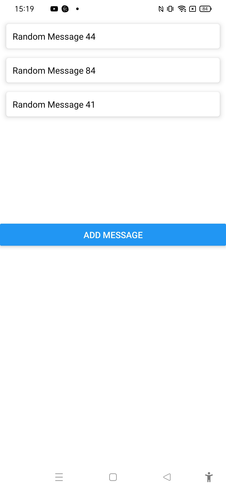

# Animated Toast Notification



The project was created as part of learning React Native tutorial using the youtube tutorial:
Code Spring

https://www.youtube.com/watch?v=cj6PBFi3OZg

## Learning

Animating expandable buttons
### Code
```js
import { StyleSheet, Text, View,TouchableOpacity,Animated } from 'react-native';

const [icon1]=useState(new Animated.Value(40));

const popIn=()=>{
  setPop(true);
  Animated.timing(icon1,{
    toValue:130,
    duration:500,
    useNativeDriver:false
  }).start()
  Animated.timing(icon2,{
    toValue:110,
    duration:500,
    useNativeDriver:false
  }).start()
  Animated.timing(icon3,{
    toValue:130,
    duration:500,
    useNativeDriver:false
  }).start()
 }
 const popOut=()=>{
  setPop(false);
  Animated.timing(icon1,{
    toValue:40,
    duration:500,
    useNativeDriver:false
  }).start()
  Animated.timing(icon2,{
    toValue:40,
    duration:500,
    useNativeDriver:false
  }).start()
  Animated.timing(icon3,{
    toValue:40,
    duration:500,
    useNativeDriver:false
  }).start()
 }

return (
    <View style={styles.container}>
      <Animated.View style={[styles.circle,{bottom:icon1}]}>
        <TouchableOpacity>
          <MaterialIcon name='cloud-upload' size={25} color={'#fff'}/>
        </TouchableOpacity>
      </Animated.View>
      <Animated.View style={[styles.circle,{bottom:icon2,right:icon2}]}>
        <TouchableOpacity>
          <MaterialIcon name='print' size={25} color={'#fff'}/>
        </TouchableOpacity>
      </Animated.View>
      <Animated.View style={[styles.circle,{right:icon3}]}>
        <TouchableOpacity>
          <MaterialIcon name='share' size={25} color={'#fff'}/>
        </TouchableOpacity>
      </Animated.View>
      <TouchableOpacity style={styles.circle} onPress={pop?popOut:popIn}>
      <MaterialIcon name='add' size={25} color={'#FFF'}/>
      </TouchableOpacity>
      <StatusBar style="auto" />
    </View>
  );
```
### Challenges faced

1. Challenge with true option for native driver in animation

### Learning further

1. Need to practice more about animation with reanimated
