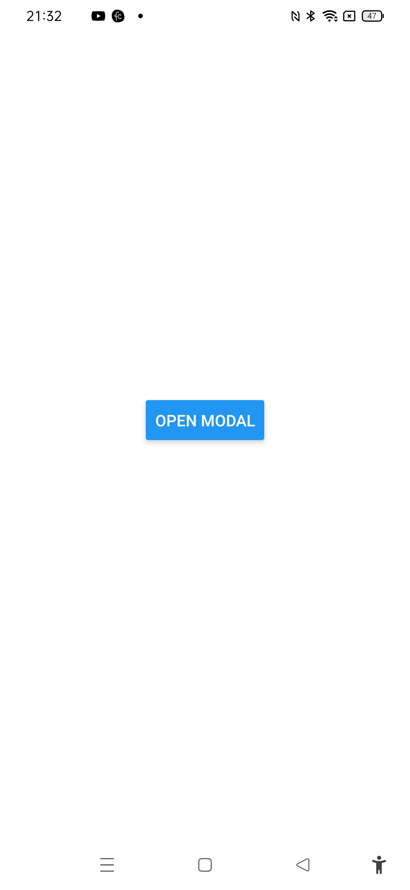
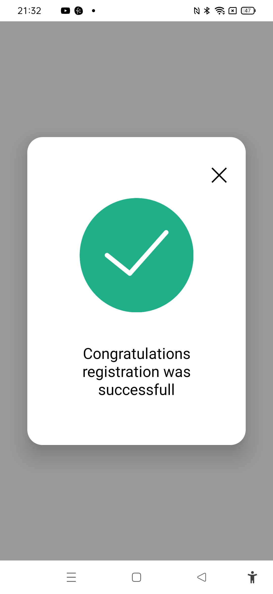

# Custom modal demo App



The project was created as part of learning React Native tutorial from the youtube channel Pradip Debnath:

[https://www.youtube.com/watch?v=PaRyx0CUTnI](https://www.youtube.com/watch?v=Q4S9M9rJAxk)

## Learning

### Fetching data onload and updating splash screen upon loading completed
```js
const API_END_POINT = "https://randomuser.me/api/?results=30";

  useEffect(() => {
    async function prepare() {
      try {
        await SplashScreen.preventAutoHideAsync();
        fetchData(API_END_POINT);
      } catch (e) {
        setIsError(true)
        console.log(e);
      } finally {
        setIsReady(true);
      }
    }
    prepare();
  }, []);

  useEffect(() => {
    SplashScreen.hideAsync();
  }, [isReady]);

const fetchData = async (url) => {
      fetch(url)
        .then((response) => response.json())
        .then((result) => {
          setUserInfo(result.results);
          setTempUserInfo(result.results);
          setIsError(false);
          setIsLoading(false);
          console.log(userInfo);
        }).catch(e=>{
          console.log(e);
          setIsError(true);
        })
  };
```

### Chcecking for error and displaying error info:

```js
{isError ? 
          <View>
            <Text style={{textAlign:'center'}}>Error in Loading....</Text>
          </View>
         : 
         <View>
            <FlatList
              data={userInfo}
              keyExtractor={(item, index) => index.toString()}
              renderItem={({ item }) => <Card item={item} />}
            />
          </View>
        }
```

### Organising card in rows and columns:

```js
const Card = ({ item }) => {
  return (
    <View style={styles.cardContainer} >
      <Image
        style={styles.avatarImage}
        source={{ uri: item.picture.thumbnail }}
      />
      <View style={styles.textContainer}>
        <Text style={styles.textName}>
          {item.name.first + " " + item.name.last}
        </Text>
        <Text style={styles.textEmail}>{item.email}</Text>
      </View>
    </View>
  );
};

const styles = StyleSheet.create({
  cardContainer: {
    flexDirection: "row",
    marginBottom: 10,
    backgroundColor: "rgba(200,200,200,0.1)",
    padding: 10,
  },
  avatarImage: {
    width: 50,
    height: 50,
    borderRadius: 25,
    marginRight: 10,
  },
  textContainer: {
    justifyContent: "center",
  },
  textName: {
    fontSize: 18,
    fontWeight: "bold",
    textAlign: "left",
  },
});
```

### Implementing search functionality with lodash.filter:

```js
const changeTextHandler = (query) => {
    setSearchText(query);
    const formattedQuery=query.toLowerCase();
    const filteredData=filter(tempUserInfo,(user)=>{
      return contains(user,formattedQuery);
    })
    setUserInfo(filteredData);
  };

  const contains=({name,email},query)=>{
    const {first,last}=name;
    if(first.includes(query)||last.includes(query)||email.includes(query)){
      return true;
    }else{
      return false;
    }
  }
```
