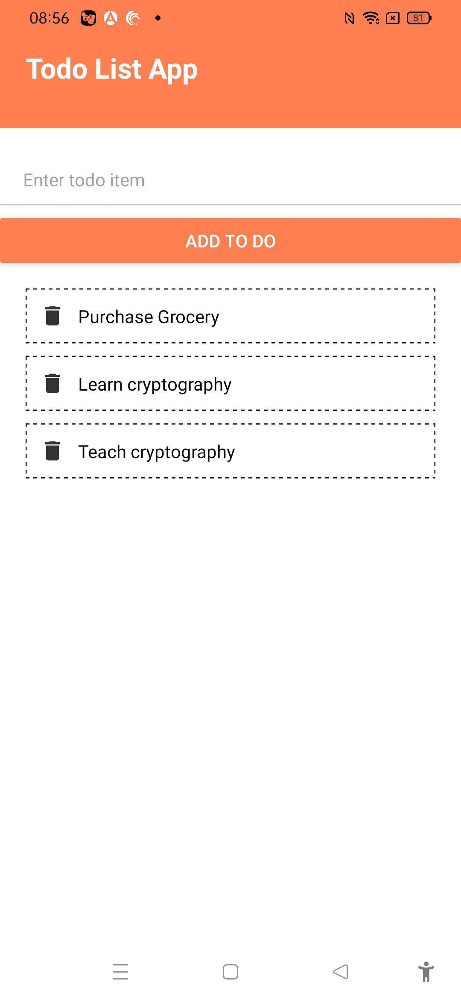

# Todo List App


The project was created as part of learning Netninja React Native tutorial.

## Learnings

-Observed difference in adding padding to containers and text inside it, doesn't work exactly like web.

-borderStyle:'dashed'

### Flatlist

```js
<FlatList
          data={todos}
          renderItem={({ item }) => (
            <TodoItem item={item} itemClickHandler={itemClickHandler} />
          )}
/>
```

-borderBottomWidth:1, borderBottomColor:'#ccc'

### Deleting item with usestate and filter:

```js
const itemClickHandler = (id) => {
    setTodos((prevTodos) => prevTodos.filter((todo) => todo.id != id));
  };
```

### Adding item with usestate:

```js
const addTodoHandler = (text) => {
    if (text.length <= 3) {
      Alert.alert("Oops!", "Input length should be greater than 3", [
        {
          text: "Understood",
          onPress: () => {
            console.log("Alert closed");
          },
        },
      ]);
    } else {
      setTodos((prevTodos) => [
        { todo: text, id: Math.random().toString() },
        ...prevTodos,
      ]);
    }
  };
```

```python
import foobar

# returns 'words'
foobar.pluralize('word')

# returns 'geese'
foobar.pluralize('goose')

# returns 'phenomenon'
foobar.singularize('phenomena')
```

## Contributing

Pull requests are welcome. For major changes, please open an issue first
to discuss what you would like to change.

Please make sure to update tests as appropriate.

## License

[MIT](https://choosealicense.com/licenses/mit/)
