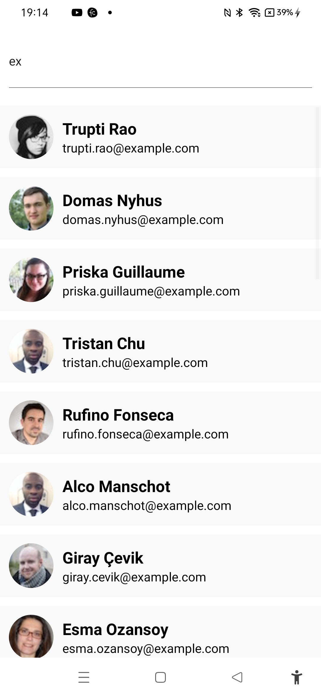

# Search Filter App


The project was created as part of learning React Native tutorial from the youtube channel Pradip Debnath:

[https://www.youtube.com/watch?v=PaRyx0CUTnI](https://www.youtube.com/watch?v=Q4S9M9rJAxk)

## Learning

### Fetching data onload and updating splash screen upon loading completed
```js
const API_END_POINT = "https://randomuser.me/api/?results=30";

  useEffect(() => {
    async function prepare() {
      try {
        await SplashScreen.preventAutoHideAsync();
        fetchData(API_END_POINT);
      } catch (e) {
        setIsError(true)
        console.log(e);
      } finally {
        setIsReady(true);
      }
    }
    prepare();
  }, []);

  useEffect(() => {
    SplashScreen.hideAsync();
  }, [isReady]);

const fetchData = async (url) => {
      fetch(url)
        .then((response) => response.json())
        .then((result) => {
          setUserInfo(result.results);
          setTempUserInfo(result.results);
          setIsError(false);
          setIsLoading(false);
          console.log(userInfo);
        }).catch(e=>{
          console.log(e);
          setIsError(true);
        })
  };
```

### Adding material icon for backspace:

```js
{text === "del" ? (
    <MaterialIcons name="backspace" size={dialPadSize/2} />
)
```

### Creating array from a limit value:

```js
let keys = [...Array(numberLimit).keys()].map((i) => i + 1);
keys = [...keys, ".", 0, "del"];
```

### Implementing backspace functionality:

```js
const keyPressHandler = (text) => {
    if (text === "del") {
      setPinCode((prevPassText) =>
        prevPassText.slice(0, prevPassText.length - 1)
      );
    }else{
      setPinCode((prevPassText) => {
        if (prevPassText.length < lockLength) {
          return [...prevPassText, text];
        }
      });
    }
  };
```

### Creating circular display

```js
<View style={styles.lock}>
        {[...Array(lockLength).keys()].map((i) => {
          const isSelected = !!pinCode[i];
          return (
            <View
              key={i}
              style={[styles.lockContainer, { height: isSelected ? 20 : 2 }]}
            ></View>
          );
        })}
</View>
```

### Creating Keypad
```js
<View style={styles.keypadContainer}>
        <FlatList
          data={keys}
          numColumns={3}
          renderItem={({ item }) => (
            <NumPadKey text={item} keyPressHandler={keyPressHandler} />
          )}
          columnWrapperStyle={{ gap: 20 }}
          contentContainerStyle={{ gap: 20 }}
        />
</View>
```

### Verifying PIN
```js
useEffect(()=>{
    console.log(pinCode.join(""));
    if(pinCode.join("")==pin){
      Alert.alert('Hurray','Pin Match');
    }
},[pinCode])
```
